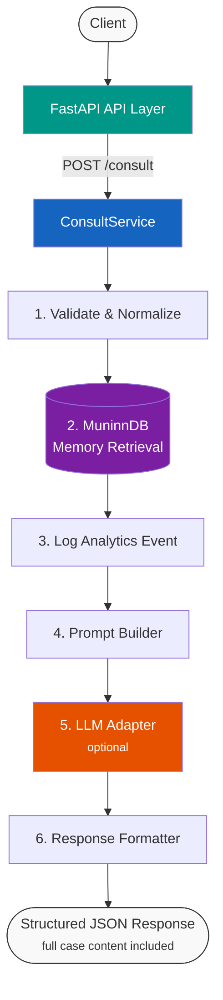
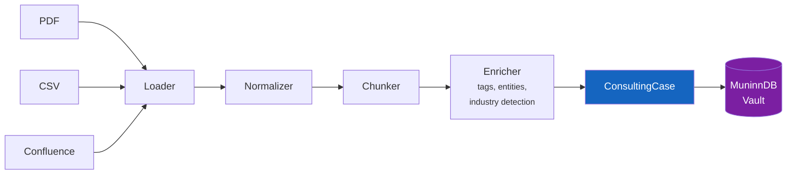
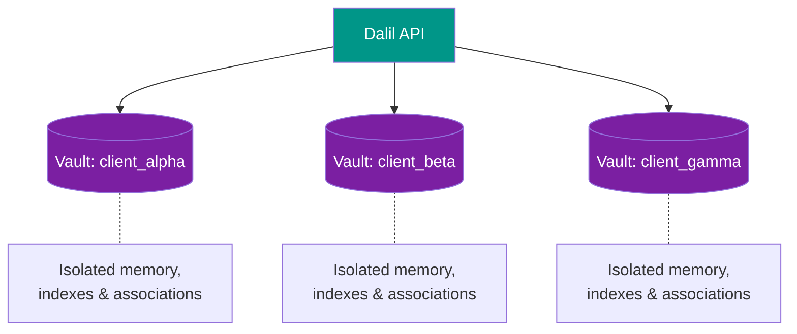

<h1 align="center">Dalil (دليل)</h1>

<p align="center">
  <em>Arabic for "guide" and "evidence"</em>
</p>

<p align="center">
  A knowledge-centric consulting memory system that ingests domain knowledge,<br>
  stores it as structured cases in <a href="https://github.com/scrypster/muninndb">MuninnDB</a>,<br>
  and delivers grounded consulting advice through a pluggable LLM layer.
</p>

<p align="center">
  
  
  
  
</p>

---

## What This Is

A **service pipeline** — not a chatbot, not a persona, not an agent graph.

| Stage | What happens |
|-------|-------------|
| **Ingest** | Confluence, CSV, PDF → normalized, chunked, enriched |
| **Store** | Structured consulting cases → MuninnDB engrams via MCP (with enrichment) |
| **Retrieve** | 6-phase cognitive pipeline with graph traversal (`max_hops`), vault isolation |
| **Route** | Extensible tool selector (memory retrieval, more tools later) |
| **Log** | Every request tracked with structured analytics |
| **Synthesize** | Provider-agnostic LLM (optional — runs retrieval-only without one) |
| **Deliver** | FastAPI → structured JSON with full case content, sources, confidence, reasoning |

---

## Architecture

### Consultation Flow



### Ingestion Flow



### Vault Isolation



---

## Why No LangGraph

Dalil uses **plain Python orchestration**. The consultation pipeline is a sequential, deterministic flow — not a graph, not an agent loop. Every step is explicit, readable, and debuggable.

No workflow engine framework is needed or used.

---

## How MuninnDB Fits In

[MuninnDB](https://github.com/scrypster/muninndb) is Dalil's sole persistent data store. It is a cognitive database that:

- Stores consulting cases as **engrams** — its native memory unit
- Handles **embeddings internally** — configurable to OpenAI, Jina, Cohere, Google, Mistral, Voyage, or local Ollama
- Provides **semantic + full-text hybrid search** via its ACTIVATE pipeline with ACT-R scoring, Hebbian co-activation, and graph traversal
- Supports **vault-per-client isolation** — each client's knowledge is fully separated
- Runs as a **local binary/server** (single Go binary, zero dependencies)

Dalil talks to MuninnDB through two protocols:

- **MCP (port 8750)** for ingestion — `muninn_remember` / `muninn_remember_batch` trigger MuninnDB's enrichment pipeline (entity extraction, knowledge graph edges)
- **REST (port 8475)** for retrieval — `POST /api/activate` with `max_hops` for spreading activation through the association graph

This means ingested cases automatically get entity extraction and graph edges, and retrieval follows association chains to surface indirectly related knowledge.

<details>
<summary><strong>ConsultingCase → Engram field mapping</strong></summary>

| ConsultingCase | MuninnDB Engram |
|----------------|-----------------|
| `title` | `concept` (max 512 bytes) |
| `content` + structured fields | `content` (body + JSON metadata, max 16KB) |
| `tags` | `tags` |
| `type` (engagement, playbook, etc.) | `type_label` |
| `entities` | `entities` (name + type pairs) |
| `relationships` | `relationships` (target_id + relation + weight) |
| `confidence` | `confidence` (0.0–1.0) |

Structured case fields (problem, solution, outcome, industry, source, etc.) are serialized as JSON in the engram content body and reconstructed on retrieval.

</details>

---

## Quick Start

### Prerequisites

- **Python 3.10+**
- **MuninnDB** (see below)
- **An LLM provider** (optional — Dalil runs retrieval-only without one)

### 1. Install MuninnDB

Pick one method:

**Option A — Docker Compose (recommended)**

```bash
docker compose up
```

This starts both MuninnDB and the Dalil API. See [Configuration](#configuration) for setup.

**Option B — Install script (macOS / Linux)**

```bash
curl -sSL https://muninndb.com/install.sh | sh
muninn init && muninn start
```

**Option C — PowerShell (Windows)**

```powershell
irm https://muninndb.com/install.ps1 | iex
muninn init
muninn start
```

**Option D — Docker standalone**

```bash
docker run -d \
  --name muninndb \
  -p 8474:8474 -p 8475:8475 -p 8476:8476 -p 8477:8477 -p 8750:8750 \
  -v muninndb-data:/data \
  ghcr.io/scrypster/muninndb:latest
```

### 2. Install Python dependencies

```bash
python -m venv .venv
source .venv/bin/activate   # Windows: .venv\Scripts\activate
pip install -r requirements.txt
```

### 3. Install the CLI

```bash
pip install -e .
```

This gives you the `dalil` command for vault management and service control.

### 4. Configure

```bash
cp dalil/config/config.example.json config.json
```

Edit `config.json` — see [Configuration](#configuration) below.

### 5. Run

**With Docker Compose (production):**

```bash
docker compose up
```

**Standalone (development):**

```bash
DALIL_CONFIG=config.json uvicorn dalil.api.main:app --host 0.0.0.0 --port 8000
```

### 6. Create a vault and ingest data

```bash
# Create a vault (auto-generates an API key for MuninnDB auth)
dalil vault create my-project

# Check status
dalil status

# Ingest data via the API
curl -X POST http://localhost:8000/ingest/csv/upload \
  -F "file=@data/cases.csv" \
  -F "vault=my-project"

# Query
curl -X POST http://localhost:8000/consult \
  -H "Content-Type: application/json" \
  -d '{"problem": "Your question here", "vault": "my-project"}'
```

### 7. Run tests

```bash
pytest dalil/tests/ -v
```

All 21 tests pass without external services.

See **[SETUP.md](SETUP.md)** for the full step-by-step guide including LLM provider setup, ingestion examples, and troubleshooting.

---

## CLI

Dalil includes a Click-based CLI for vault management and service control:

```bash
dalil status                    # Check MuninnDB container status
dalil serve                     # Start the Dalil API server
dalil vault list                # List all vaults
dalil vault create my-project   # Create a vault (auto-generates API key)
dalil vault delete my-project   # Delete a vault
dalil vault clone src dest      # Clone a vault
dalil vault key my-project      # Show the API key for a vault
```

Vault API keys are stored in `.dalil/vaults.json` and automatically used for per-vault authentication with MuninnDB.

---

## Configuration

### config.json (example)

Copy `dalil/config/config.example.json` to `config.json` and edit to match your setup.

```jsonc
{
  "muninn": {
    "base_url": "http://localhost:8476",
    "mcp_url": "http://localhost:8750/mcp",
    "default_vault": "default",
    "timeout": 60.0
  },

  // LLM — optional. Remove this section or set "model": "" for retrieval-only mode.
  "llm": {
    "type": "api",                            // "api" | "local"
    "provider": "ollama",                     // openai, anthropic, ollama, deepseek,
                                              // groq, together, mistral, fireworks
    "model": "deepseek-v3.1:671b-cloud",      // model name for the provider
    "api_key": "",                            // required for cloud providers
    "base_url": "http://localhost:11434/v1",  // auto-resolved from provider if empty
    "temperature": 0.3,                       // 0.0–1.0
    "max_tokens": 2048                        // max response tokens
  },

  // Embeddings — handled by MuninnDB. Set provider + api_key here,
  // Dalil passes the key to MuninnDB via the correct env var.
  "embeddings": {
    "provider": "openai",                     // openai, jina, cohere, google,
                                              // mistral, voyage (or empty for local/ollama)
    "api_key": "",                            // required for cloud providers
    "model_name": ""                          // optional — MuninnDB uses provider default if empty
  },

  "ingestion": {
    "chunk_size": 1000,
    "chunk_overlap": 200
  }
}
```

> **Retrieval-only mode:** set `"model": ""` in the `llm` section (or remove it entirely).
> Dalil will return full case content, scores, and sources without an LLM recommendation.

### Environment variable overrides

Environment variables take priority over `config.json` (empty values are ignored):

| Variable | Overrides |
|----------|-----------|
| `DALIL_CONFIG` | Path to config JSON file |
| `MUNINN_URL` | `muninn.base_url` |
| `MUNINN_MCP_URL` | `muninn.mcp_url` |
| `MUNINN_TOKEN` | `muninn.token` |
| `LLM_API_KEY` | `llm.api_key` |
| `LLM_BASE_URL` | `llm.base_url` |
| `LLM_MODEL` | `llm.model` |
| `EMBED_PROVIDER` | `embeddings.provider` |
| `EMBED_API_KEY` | `embeddings.api_key` |

### .env file (Docker Compose)

```env
# LLM
LLM_API_KEY=
LLM_BASE_URL=http://host.docker.internal:11434/v1
LLM_MODEL=deepseek-v3.1:671b-cloud

# Embedding — provider + key, Dalil routes to the correct MuninnDB env var
EMBED_PROVIDER=openai        # openai, jina, cohere, google, mistral, voyage
EMBED_API_KEY=sk-proj-...
```

---

## LLM Providers

The LLM layer is fully provider-agnostic. Any OpenAI-compatible API works. The LLM is **optional** — without one, Dalil returns raw retrieval results (cases, scores, sources) with no synthesized recommendation.

| Provider | Config |
|----------|--------|
| **Ollama** (local, free) | `"provider": "ollama", "base_url": "http://localhost:11434/v1"` |
| **OpenAI** | `"provider": "openai", "api_key": "sk-..."` |
| **Anthropic (Claude)** | `"provider": "anthropic", "api_key": "sk-ant-...", "model": "claude-sonnet-4-20250514"` |
| **DeepSeek** | `"provider": "deepseek", "api_key": "sk-..."` |
| **Groq** | `"provider": "groq", "api_key": "gsk_..."` |
| **Together** | `"provider": "together", "api_key": "..."` |
| **Mistral** | `"provider": "mistral", "api_key": "..."` |
| **Fireworks** | `"provider": "fireworks", "api_key": "..."` |
| **vLLM / LM Studio** | `"base_url": "http://localhost:8000/v1"` |
| **HuggingFace** (local) | `"type": "local", "model": "mistralai/Mistral-7B-Instruct-v0.2"` |

When `provider` is set and `base_url` is empty, Dalil auto-resolves the correct API endpoint.

## Embedding Providers

MuninnDB handles embeddings internally. Set the API key for your provider in `.env`:

| Provider | .env variable | Notes |
|----------|--------------|-------|
| **OpenAI** | `MUNINN_OPENAI_KEY` | text-embedding-3-small (default) |
| **Jina** | `MUNINN_JINA_KEY` | |
| **Cohere** | `MUNINN_COHERE_KEY` | |
| **Google** | `MUNINN_GOOGLE_KEY` | |
| **Mistral** | `MUNINN_MISTRAL_KEY` | |
| **Voyage** | `MUNINN_VOYAGE_KEY` | |
| **Ollama** (local) | None needed | Uses bundled model, runs on CPU |

Only one embedding provider key should be set. MuninnDB auto-detects which provider to use based on which key is present.

---

## API Endpoints

| Method | Path | Description |
|--------|------|-------------|
| `POST` | `/consult` | Submit a consulting query, get grounded advice |
| `POST` | `/feedback` | Signal whether consultation results were useful or not |
| `GET` | `/vault/stats` | Knowledge health metrics (engram count, confidence, contradictions) |
| `POST` | `/ingest/csv` | Ingest CSV from server file path |
| `POST` | `/ingest/pdf` | Ingest PDF from server file path |
| `POST` | `/ingest/csv/upload` | Ingest CSV via multipart upload |
| `POST` | `/ingest/pdf/upload` | Ingest PDF via multipart upload |
| `POST` | `/ingest/confluence` | Ingest pages from a Confluence space |
| `GET` | `/health` | Health check (MuninnDB + LLM status) |

### Example: Consult

```bash
curl -X POST http://localhost:8000/consult \
  -H "Content-Type: application/json" \
  -d '{
    "problem": "What retention strategies worked for fintech clients with onboarding churn above 15%?",
    "context": "Client is mid-market fintech. Budget is limited.",
    "tags": ["fintech", "churn", "onboarding"],
    "vault": "client_acme"
  }'
```

<details>
<summary>Response</summary>

```json
{
  "request_id": "a1b2c3d4-...",
  "recommendation": "Based on similar engagements...",
  "similar_cases": [
    {
      "id": "...",
      "title": "Fintech Onboarding Optimization",
      "type": "engagement",
      "industry": "fintech",
      "score": 0.87,
      "content": "Full case content with all details...",
      "summary": "...",
      "problem": "High onboarding churn in mid-market fintech",
      "solution": "Simplified KYC flow, progressive onboarding",
      "outcome": "Churn reduced from 18% to 9%",
      "context": "...",
      "tags": ["fintech", "churn", "onboarding"],
      "metadata": {}
    }
  ],
  "sources": [
    {"type": "csv", "uri": "/data/cases.csv", "title": "Fintech Onboarding Optimization"}
  ],
  "tools_used": ["muninn_memory"],
  "confidence": 0.72,
  "reasoning_summary": "Based on similar engagements..."
}
```

When no LLM is configured, `recommendation` and `reasoning_summary` are empty, but `similar_cases` still includes full case content for direct consumption.

</details>

### Example: Feedback

```bash
curl -X POST http://localhost:8000/feedback \
  -H "Content-Type: application/json" \
  -d '{
    "request_id": "a1b2c3d4-...",
    "signal": "useful"
  }'
```

This re-activates the returned cases (boosting their temporal priority) and links them with `supports` relations so they strengthen each other in future queries.

### Example: Vault Stats

```bash
curl http://localhost:8000/vault/stats?vault=client_acme
```

Returns engram count, confidence distribution, coherence scores, and contradiction count.

---

## Claude Code Integration

Dalil ships with 6 slash commands for [Claude Code](https://claude.ai/claude-code), enabling AI-assisted workflows that are grounded in your knowledge base.

### Commands

| Command | Description |
|---------|-------------|
| `/consult <problem>` | Query Dalil for relevant cases and grounded recommendations |
| `/ingest <file>` | Ingest CSV or PDF files into a vault |
| `/feedback <request_id> <useful\|not_useful>` | Send feedback on a consultation to improve future results |
| `/check` | Check vault health — engram count, contradictions, confidence distribution |
| `/context-gatherer <task>` | Multi-query context collection with cross-referencing and contradiction detection |
| `/doc-writer <topic>` | Generate documentation grounded in Dalil's knowledge base |

### Usage

All commands accept `--vault` and `--tags` flags:

```
/consult "What retention strategies worked for fintech clients?" --vault=client_acme --tags=fintech,churn
/ingest data/cases.csv --vault=client_acme --tags=engagement
/check --vault=client_acme
/feedback a1b2c3d4-... useful --comment="Accurate recommendation"
```

### Sub-agent workflows

`/context-gatherer` and `/doc-writer` are composable sub-agents:

- **Context Gatherer** — decomposes a task into sub-questions, runs multiple consultations, cross-references cases, flags contradictions, and produces a structured context package
- **Doc Writer** — uses the context gatherer to collect evidence, then writes documentation where every claim traces back to a Dalil case. Sections without evidence are marked `[NEEDS INPUT]`

Both support `--depth=deep` for more thorough analysis.

---

## Project Structure

```
dalil/
  api/                  # FastAPI endpoints and request/response models
  cli.py                # Click CLI for vault management and service control
  services/             # ConsultService orchestrator, ingestion, prompt builder
  memory/               # MemoryBackend interface, MuninnDB adapter, case schema
  ingestion/            # Loaders (CSV, PDF, Confluence), normalizer, chunker, enricher
  tools/                # Tool selector (extensible for future data tools)
  llm/                  # LLM interface, API/local implementations, factory
  analytics/            # Structured logging, metrics, event definitions
  config/               # Settings loader with provider mappings
  tests/                # 21 unit tests
  scripts/              # MuninnDB bootstrap script
.dalil/                 # Per-vault API keys (auto-generated, gitignored)
config.json             # Main configuration file
pyproject.toml          # Package definition with console_scripts entry point
docker-compose.yml      # Production + dev containers
```

---

## Current Limitations

- **Tool selector** — keyword/regex routing, no semantic intent understanding
- **Enricher** — heuristic-based entity extraction and tagging
- **Confluence** — requires working Atlassian credentials
- **No auth** — no authentication middleware on the API
- **No rate limiting** — on API or MuninnDB calls
- **Single-process** — no distributed task queue for heavy ingestion
- **No grounding validation** — LLM output is not yet validated against retrieved cases ([#6](https://github.com/KhaledAwashreh/Dalil/issues/6))

---

## Roadmap

- [x] MCP ingestion with enrichment pipeline (entity extraction, graph edges)
- [x] Spreading activation via `max_hops` on retrieval
- [x] Feedback loop (re-activation, case linking, archival)
- [x] Vault health stats with contradiction detection
- [x] CLI for vault management with per-vault API key auth
- [x] Retrieval-only mode (LLM optional)
- [x] Full case content in consult response
- [x] Dynamic LLM and embedding provider support
- [ ] Grounding validation step ([#6](https://github.com/KhaledAwashreh/Dalil/issues/6))
- [ ] LLM-based entity extraction and summarization
- [ ] API authentication and authorization
- [ ] WebSocket endpoint for streaming responses
- [ ] Prometheus metrics exporter
- [ ] Integration tests with live MuninnDB
- [ ] CI/CD pipeline

---

## License

TBD
