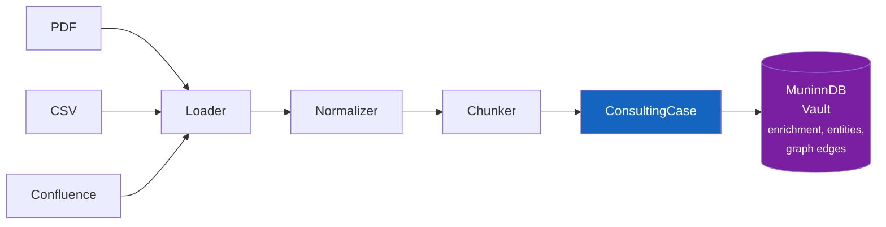
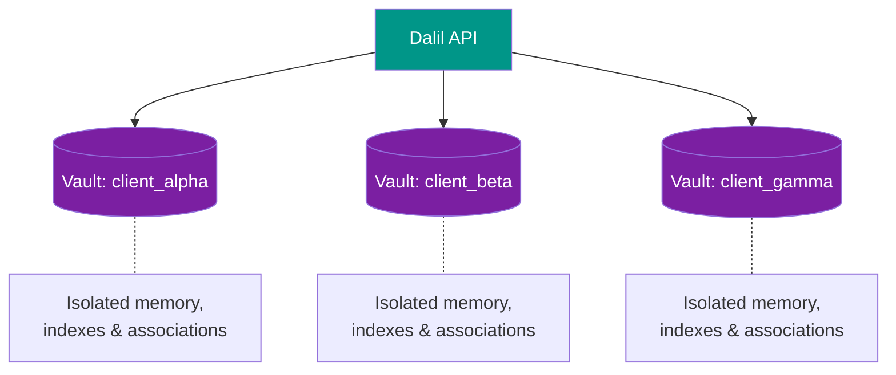

<h1 align="center">Dalil (دليل)</h1>

<p align="center">
  <em>Arabic for "guide" and "evidence"</em>
</p>

<p align="center">
  A knowledge-centric consulting memory system that ingests domain knowledge,<br>
  stores it as structured cases in <a href="https://github.com/scrypster/muninndb">MuninnDB</a>,<br>
  and delivers grounded consulting advice through a pluggable LLM layer.
</p>

<p align="center">
  
  
  
  
</p>

---

## What This Is

A **thin orchestrator on MuninnDB** — not a chatbot, not a persona, not an agent graph.

| Stage | What happens |
|-------|-------------|
| **Ingest** | Confluence, CSV, PDF → normalized, chunked |
| **Store** | Cases → MuninnDB via MCP (`muninn_remember`) — MuninnDB handles enrichment (entities, graph edges) |
| **Retrieve** | MuninnDB ACTIVATE pipeline (semantic + full-text hybrid search, graph traversal) |
| **Log** | Every request tracked with structured analytics |
| **Synthesize** | Provider-agnostic LLM (optional — runs retrieval-only without one) |
| **Deliver** | FastAPI → structured JSON with full case content, sources, confidence, reasoning |

---

## Architecture

### Consultation Flow


### Ingestion Flow



### Vault Isolation



---

## Why No LangGraph

Dalil uses **plain Python orchestration**. The consultation pipeline is a sequential, deterministic flow — not a graph, not an agent loop. Every step is explicit, readable, and debuggable.

No workflow engine framework is needed or used.

---

## Documentation

- **[SETUP.md](SETUP.md)** — Installation, MuninnDB setup, quick-start walkthrough
- **[docs/ARCHITECTURE.md](docs/ARCHITECTURE.md)** — Deep dive: MuninnDB integration, communication protocols, ACTIVATE pipeline, data model
- **[docs/CONFIGURATION.md](docs/CONFIGURATION.md)** — config.json schema, environment variables, vault management CLI, Docker setup
- **[docs/LLM_PROVIDERS.md](docs/LLM_PROVIDERS.md)** — LLM & embedding provider setup (OpenAI, Anthropic, Ollama, DeepSeek, etc.)
- **[docs/API_REFERENCE.md](docs/API_REFERENCE.md)** — Full REST API endpoint reference with examples
- **[docs/PROJECT_STRUCTURE.md](docs/PROJECT_STRUCTURE.md)** — Directory layout, key modules, code organization, testing strategy
- **[docs/DEVELOPMENT.md](docs/DEVELOPMENT.md)** — Limitations, roadmap, ADRs, debugging tips, monitoring, CI/CD setup

---

## Quick Start

### 1. Install MuninnDB

```bash
# Docker Compose (recommended)
docker compose up
```

### 2. Install dependencies

```bash
pip install -r requirements.txt
pip install -e .  # CLI support
```

### 3. Configure

```bash
cp dalil/config/config.example.json config.json
# Edit config.json for your LLM/embedding provider
```

### 4. Create vault & ingest

```bash
dalil vault create my-project
curl -X POST http://localhost:8475/ingest/csv \
  -F "file=@data.csv" \
  -F "vault=my-project"
```

### 5. Query

```bash
curl -X POST http://localhost:8475/consult \
  -H "Content-Type: application/json" \
  -d '{"query": "Your question", "vault": "my-project"}'
```

See **[SETUP.md](SETUP.md)** for full walkthrough.

---

## CLI

```bash
dalil vault create <client>        # Create a vault
dalil vault list                   # List vaults
dalil vault stats --vault <name>   # Vault statistics
dalil vault key --vault <name>     # Get API key
dalil vault clone --source <s> --destination <d>  # Clone vault
dalil vault delete --vault <name>  # Delete vault
```

---

## 18 REST API Endpoints

**Consultation:**
- `POST /consult` — Query & synthesize
- `POST /feedback` — Log relevance feedback

**Vault Management:**
- `GET /vault/stats` — Knowledge statistics
- `GET /vault/health` — Vault health check
- `GET /vault/recent` — Recently accessed cases

**Ingestion:**
- `POST /ingest/csv` — Ingest CSV
- `POST /ingest/pdf` — Ingest PDF
- `POST /ingest/confluence` — Ingest Confluence

**Entity Management:**
- `GET /entities` — List entities
- `POST /entities/merge` — Merge duplicates
- `DELETE /entities/{id}` — Delete entity

**Traversal:**
- `POST /traverse` — Graph traversal

**Health:**
- `GET /health` — System health

Full reference: [docs/API_REFERENCE.md](docs/API_REFERENCE.md)

---

## License

MIT License (see LICENSE file)
