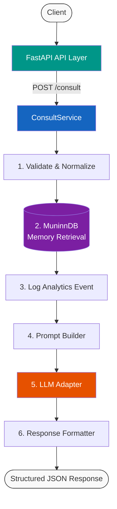
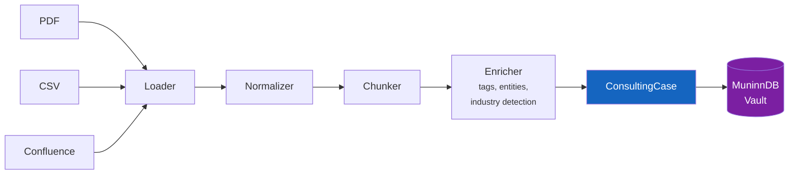
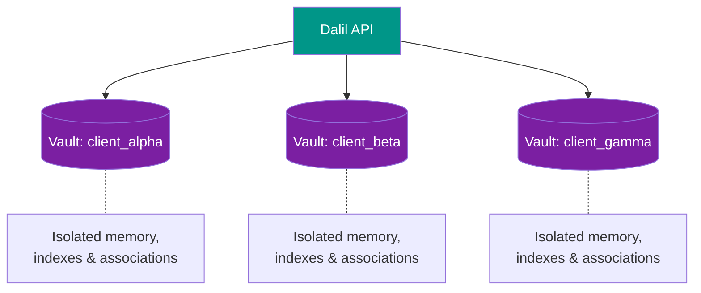

<h1 align="center">Dalil (دليل)</h1>

<p align="center">
  <em>Arabic for "guide" and "evidence"</em>
</p>

<p align="center">
  A knowledge-centric consulting memory system that ingests domain knowledge,<br>
  stores it as structured cases in <a href="https://github.com/scrypster/muninndb">MuninnDB</a>,<br>
  and delivers grounded consulting advice through a pluggable LLM layer.
</p>

<p align="center">
  
  
  
  
</p>

---

## What This Is

A **service pipeline** — not a chatbot, not a persona, not an agent graph.

| Stage | What happens |
|-------|-------------|
| **Ingest** | Confluence, CSV, PDF → normalized, chunked, enriched |
| **Store** | Structured consulting cases → MuninnDB engrams |
| **Retrieve** | Semantic + keyword hybrid search, vault-per-client isolation |
| **Route** | Extensible tool selector (memory retrieval, more tools later) |
| **Log** | Every request tracked with structured analytics |
| **Synthesize** | Provider-agnostic LLM (Ollama, OpenAI, vLLM, LM Studio, etc.) |
| **Deliver** | FastAPI → structured JSON with sources, confidence, reasoning |

---

## Architecture

### Consultation Flow



### Ingestion Flow



### Vault Isolation



---

## Why No LangGraph

Dalil uses **plain Python orchestration**. The consultation pipeline is a sequential, deterministic flow — not a graph, not an agent loop. Every step is explicit, readable, and debuggable.

No workflow engine framework is needed or used.

---

## How MuninnDB Fits In

[MuninnDB](https://github.com/scrypster/muninndb) is Dalil's sole persistent data store. It is a cognitive database that:

- Stores consulting cases as **engrams** — its native memory unit
- Handles **embeddings internally** (bundled all-MiniLM-L6-v2 by default, configurable to OpenAI, Ollama, Voyage, Cohere, Jina, Mistral, Google)
- Provides **semantic + full-text hybrid search** via its ACTIVATE pipeline with ACT-R scoring, Hebbian co-activation, and graph traversal
- Supports **vault-per-client isolation** — each client's knowledge is fully separated
- Runs as a **local binary/server** (single Go binary, zero dependencies)

Dalil talks to MuninnDB through the official `muninn-python` async SDK. All MuninnDB-specific logic is isolated behind a `MemoryBackend` abstract interface, making the backend swappable.

<details>
<summary><strong>ConsultingCase → Engram field mapping</strong></summary>

| ConsultingCase | MuninnDB Engram |
|----------------|-----------------|
| `title` | `concept` (max 512 bytes) |
| `content` + structured fields | `content` (body + JSON metadata, max 16KB) |
| `tags` | `tags` |
| `type` (engagement, playbook, etc.) | `type_label` |
| `entities` | `entities` (name + type pairs) |
| `relationships` | `relationships` (target_id + relation + weight) |
| `confidence` | `confidence` (0.0–1.0) |

Structured case fields (problem, solution, outcome, industry, source, etc.) are serialized as JSON in the engram content body and reconstructed on retrieval.

</details>

---

## Quick Start (Docker)

The fastest way to run Dalil. Requires only [Docker](https://docs.docker.com/get-docker/) and [Docker Compose](https://docs.docker.com/compose/).

### 1. Clone and configure

```bash
git clone https://github.com/KhaledAwashreh/Dalil.git
cd Dalil
```

Create a `.env` file in the project root with your LLM settings:

```bash
# .env
LLM_API_KEY=sk-...          # Required for OpenAI/Anthropic; leave empty for Ollama
LLM_BASE_URL=               # e.g. http://host.docker.internal:11434/v1 for Ollama on host
LLM_MODEL=mistral            # Model name
MUNINN_TOKEN=                # MuninnDB vault token (optional for local dev)
```

> **Ollama on host machine**: Use `http://host.docker.internal:11434/v1` as `LLM_BASE_URL` so the container can reach Ollama running on your host.

### 2. Start everything

```bash
docker compose up -d
```

This launches:
- **MuninnDB** on ports 8474-8477 and 8750 (with persistent `muninndb-data` volume)
- **Dalil API** on port 8000 (with persistent `dalil-logs` volume)

Dalil waits for MuninnDB to be healthy before starting.

### 3. Verify

```bash
curl http://localhost:8000/health
```

Expected:

```json
{
  "status": "ok",
  "muninn_connected": true,
  "llm_provider": "APILLM",
  "llm_model": "mistral"
}
```

API docs: **http://localhost:8000/docs** (Swagger UI)
MuninnDB dashboard: **http://localhost:8476**

### 4. Development mode (live code editing)

Mount your local source into the container with hot-reload:

```bash
docker compose --profile dev up -d
```

This starts `dalil-api-dev` instead, which:
- Mounts `./dalil` into the container
- Runs uvicorn with `--reload` so code changes take effect immediately
- Uses the same MuninnDB instance

> **Note**: Do not run both `dalil-api` and `dalil-api-dev` simultaneously — they share port 8000.

### Docker volumes

| Volume | Purpose |
|--------|---------|
| `muninndb-data` | MuninnDB persistent storage (engrams, indexes, vaults) |
| `dalil-logs` | Dalil analytics logs (`consult_events.jsonl`, `ingest_events.jsonl`) |

To inspect logs:

```bash
docker compose exec dalil-api cat /app/logs/consult_events.jsonl
```

### Stopping

```bash
docker compose down        # Stop containers (data persists in volumes)
docker compose down -v     # Stop and remove volumes (deletes all data)
```

### Custom config file

To use a full `config.json` instead of environment variables:

```bash
# Mount your config file
docker run --rm \
  -v $(pwd)/config.json:/app/config.json:ro \
  -e DALIL_CONFIG=/app/config.json \
  -p 8000:8000 \
  --network host \
  dalil-api
```

---

## Developer Setup (Local)

For running Dalil from source without Docker.

### Prerequisites

- **Python 3.10+**
- **MuninnDB** (see below)
- **An LLM provider** (Ollama, OpenAI, Anthropic, vLLM, etc.)

### 1. Install MuninnDB

Pick one method:

**Option A — Install script (macOS / Linux)**

```bash
curl -sSL https://muninndb.com/install.sh | sh
muninn init && muninn start
```

**Option B — PowerShell (Windows)**

```powershell
irm https://muninndb.com/install.ps1 | iex
muninn init
muninn start
```

**Option C — Docker (any OS)**

```bash
docker run -d \
  --name muninndb \
  -p 8474:8474 -p 8475:8475 -p 8476:8476 -p 8477:8477 -p 8750:8750 \
  -v muninndb-data:/data \
  ghcr.io/scrypster/muninndb:latest
```

**Option D — Bootstrap script (included)**

```bash
chmod +x dalil/scripts/bootstrap_muninn.sh
./dalil/scripts/bootstrap_muninn.sh
```

### 2. Install Python dependencies

```bash
python -m venv .venv
source .venv/bin/activate   # Windows: .venv\Scripts\activate
pip install -r requirements.txt
```

### 3. Configure

```bash
cp dalil/config/config.example.json config.json
```

Edit `config.json` to set your LLM provider and MuninnDB connection. Key fields:

```json
{
  "muninn": {
    "base_url": "http://localhost:8476",
    "default_vault": "default"
  },
  "llm": {
    "provider": "ollama",
    "model": "mistral",
    "base_url": "http://localhost:11434/v1"
  }
}
```

Or use **environment variable overrides** (take priority over the config file):

| Variable | Overrides |
|----------|-----------|
| `DALIL_CONFIG` | Path to config JSON file |
| `MUNINN_URL` | `muninn.base_url` |
| `MUNINN_TOKEN` | `muninn.token` |
| `LLM_API_KEY` | `llm.api_key` |
| `LLM_BASE_URL` | `llm.base_url` |
| `LLM_MODEL` | `llm.model` |

### 4. Run

```bash
DALIL_CONFIG=config.json uvicorn dalil.api.main:app --host 0.0.0.0 --port 8000
```

Windows (PowerShell):

```powershell
$env:DALIL_CONFIG = "config.json"
uvicorn dalil.api.main:app --host 0.0.0.0 --port 8000
```

### 5. Run tests

```bash
pytest dalil/tests/ -v
```

All 21 tests pass without external services.

See **[SETUP.md](SETUP.md)** for the full step-by-step guide including LLM provider setup, ingestion examples, and troubleshooting.

---

## API Endpoints

| Method | Path | Description |
|--------|------|-------------|
| `POST` | `/consult` | Submit a consulting query, get grounded advice |
| `POST` | `/ingest/csv` | Ingest CSV from server file path |
| `POST` | `/ingest/pdf` | Ingest PDF from server file path |
| `POST` | `/ingest/csv/upload` | Ingest CSV via multipart upload |
| `POST` | `/ingest/pdf/upload` | Ingest PDF via multipart upload |
| `POST` | `/ingest/confluence` | Ingest pages from a Confluence space |
| `GET` | `/health` | Health check (MuninnDB + LLM status) |

### Example: Consult

```bash
curl -X POST http://localhost:8000/consult \
  -H "Content-Type: application/json" \
  -d '{
    "problem": "What retention strategies worked for fintech clients with onboarding churn above 15%?",
    "context": "Client is mid-market fintech. Budget is limited.",
    "tags": ["fintech", "churn", "onboarding"],
    "vault": "client_acme"
  }'
```

<details>
<summary>Response</summary>

```json
{
  "request_id": "a1b2c3d4-...",
  "recommendation": "Based on similar engagements...",
  "similar_cases": [
    {
      "id": "...",
      "title": "Fintech Onboarding Optimization",
      "type": "engagement",
      "industry": "fintech",
      "score": 0.87
    }
  ],
  "sources": [
    {"type": "csv", "uri": "/data/cases.csv", "title": "Fintech Onboarding Optimization"}
  ],
  "tools_used": ["muninn_memory"],
  "confidence": 0.72,
  "reasoning_summary": "Based on similar engagements..."
}
```

</details>

---

## LLM Providers

Dalil's LLM layer is fully provider-agnostic. Any OpenAI-compatible API works.

| Provider | Config |
|----------|--------|
| **Ollama** (local, free) | `"provider": "ollama", "base_url": "http://localhost:11434/v1"` |
| **OpenAI** | `"provider": "openai", "api_key": "sk-..."` |
| **Anthropic (Claude)** | `"provider": "anthropic", "api_key": "sk-ant-...", "model": "claude-sonnet-4-20250514"` |
| **vLLM / LM Studio** | `"base_url": "http://localhost:8000/v1"` |
| **HuggingFace** (local) | `"type": "local", "model": "mistralai/Mistral-7B-Instruct-v0.2"` |

See [SETUP.md — LLM Provider Examples](SETUP.md#llm-provider-examples) for full config snippets.

---

## Project Structure

```
dalil/
  api/                  # FastAPI endpoints and request/response models
  services/             # ConsultService orchestrator, ingestion, prompt builder
  memory/               # MemoryBackend interface, MuninnDB adapter, case schema
  ingestion/            # Loaders (CSV, PDF, Confluence), normalizer, chunker, enricher
  tools/                # Tool selector (extensible for future data tools)
  llm/                  # LLM interface, API/local implementations, factory
  analytics/            # Structured logging, metrics, event definitions
  config/               # Settings loader and example config
  tests/                # 21 unit tests
  scripts/              # MuninnDB bootstrap script
```

---

## Current Limitations

- **Tool selector** — keyword/regex routing, no semantic intent understanding
- **Enricher** — heuristic-based entity extraction and tagging
- **Confluence** — requires working Atlassian credentials
- **No auth** — no authentication middleware on the API
- **No rate limiting** — on API or MuninnDB calls
- **Single-process** — no distributed task queue for heavy ingestion

---

## Roadmap

- [x] Docker & Docker Compose support
- [ ] LLM-based entity extraction and summarization
- [ ] API authentication and authorization
- [ ] WebSocket endpoint for streaming responses
- [ ] Prometheus metrics exporter
- [ ] Integration tests with live MuninnDB
- [ ] PostgreSQL support for structured data queries
- [ ] CI/CD pipeline

---

## License

TBD
