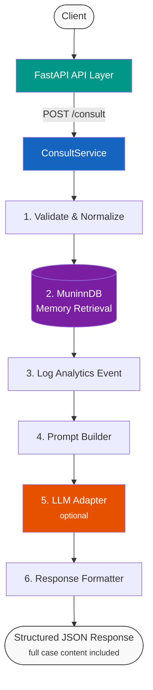
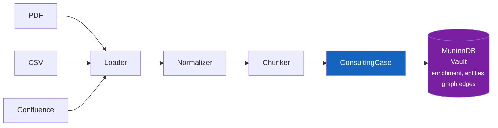
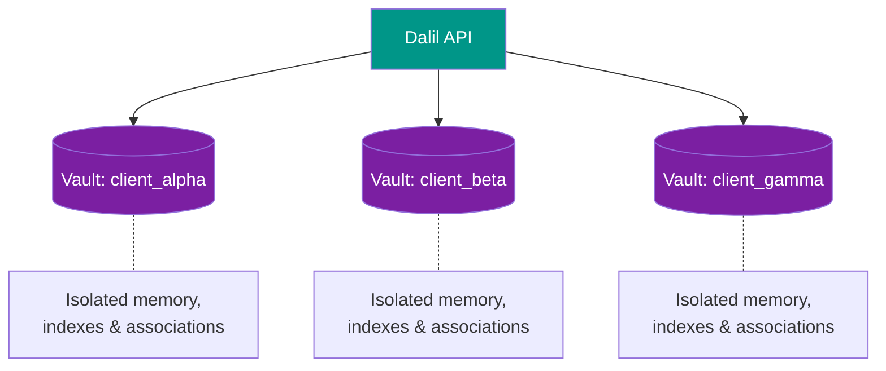

# Architecture

## How MuninnDB Fits In

[MuninnDB](https://github.com/scrypster/muninndb) is Dalil's sole persistent data store. It is a cognitive database that:

- Stores consulting cases as **engrams** — its native memory unit
- Handles **embeddings internally** — configurable to OpenAI, Jina, Cohere, Google, Mistral, Voyage, or local Ollama
- Provides **semantic + full-text hybrid search** via its ACTIVATE pipeline with ACT-R scoring, Hebbian co-activation, and graph traversal
- Supports **vault-per-client isolation** — each client's knowledge is fully separated
- Runs as a **local binary/server** (single Go binary, zero dependencies)

## Communication Protocols

Dalil talks to MuninnDB through two protocols:

- **MCP (port 8750)** for ingestion — `muninn_remember` / `muninn_remember_batch` delegate enrichment (entity extraction, knowledge graph edges, Bayesian confidence) entirely to MuninnDB
- **REST (port 8475)** for retrieval — `POST /api/activate` with `max_hops` for spreading activation through the association graph
- **MCP tools** for feedback (`muninn_feedback`, `muninn_link`), confidence explanation (`muninn_explain`), vault health (`muninn_status`, `muninn_contradictions`), and lifecycle (`muninn_evolve`, `muninn_consolidate`)

Dalil is a thin orchestrator: loaders normalize data into cases, MuninnDB handles enrichment and storage, ACTIVATE handles retrieval, and an optional LLM synthesizes the results.

## Data Model

### ConsultingCase → Engram Field Mapping

| ConsultingCase | MuninnDB Engram |
|----------------|-----------------|
| `title` | `concept` (max 512 bytes) |
| `content` + structured fields | `content` (body + JSON metadata, max 16KB) |
| `tags` | `tags` |
| `type` (engagement, playbook, etc.) | `type_label` |
| `entities` | `entities` (name + type pairs) |
| `relationships` | `relationships` (target_id + relation + weight) |
| `confidence` | `confidence` (0.0–1.0) |

Structured case fields (problem, solution, outcome, industry, source, etc.) are serialized as JSON in the engram content body and reconstructed on retrieval.

## Pipeline Flows

### Consultation Flow

### Ingestion Flow

### Vault Isolation

## Why No LangGraph

Dalil uses **plain Python orchestration**. The consultation pipeline is a sequential, deterministic flow — not a graph, not an agent loop. Every step is explicit, readable, and debuggable.

No workflow engine framework is needed or used.
